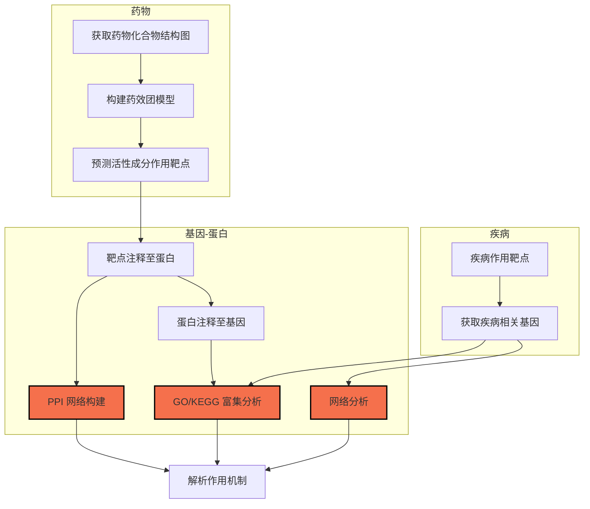

通过数据库获取药物的一系列化合物，并对每一个化合物进行靶点预测，再对预测的靶点注释，进入下游分析，进行生物学功能，进而获取 药物-化合物-靶点 之间相互调控的关系。

**药效团模型**：基于药效特征元素（氢键受体、氢键供体、正负电荷中心、芳香环中心、疏水基团、亲水基团和几何构象），建立的模型

[网络药理学入门-bilibili](https://www.bilibili.com/video/BV1EX4y1M7sc?from=search&seid=9352889172174700007)
<!-- more -->

## 网络药理学大致分析流程

### 基于药效团分析

## 可用数据库

| **网站名字**        | **网站地址**                               | 备注       |
| ------------------- | ------------------------------------------ | ---------- |
| **有效成分获取**    |                                            |            |
| BATMAN-TCM          | <http://bionet.ncpsb.org/batman-tcm/>      |            |
| TCM Database@Taiwan | <http://tcm.cmu.edu.tw/>                   |            |
| TCM-MESH            | <http://mesh.tcm.microbioinformatics.org/> |            |
| TCM-PTD             | <http://tcm.zju.edu.cn/ptd/>               |            |
| TCMGeneDIT          | <http://tcm.lifescience.ntu.edu.tw/>       |            |
| TCMID               | <http://www.megabionet.org/tcmid/>         | 偶尔打不开 |
| TCMSP               | <http://lsp.nwu.edu.cn/tcmsp.php>          |            |

| **网站名字**             | **网站地址**                                      | 备注                                              |     |     |
| ------------------------ | ------------------------------------------------- | ------------------------------------------------- | --- | --- |
| **有效成分作用靶点分析** |                                                   |                                                   |     |     |
| ALOGPS2.1                | <http://www.vcclab.org/lab/alogps/>               | 化学性质预测                                      |     |     |
| Binding DB               | <http://www.bindingdb.org/bind/index.jsp>         | 小分子化合物蛋白互作亲和力                        |     |     |
| BioGRID                  | <https://thebiogrid.org/>                         | ppi 化合物相互作用和翻译后修饰                    |     |     |
| CMAP                     | <https://portals.broadinstitute.org/cmap/>        | 小分子化合物为主)处理的细胞系进行转录组层面的测序 |     |     |
| PharmMapper              | <http://lilab.ecust.edu.cn/pharmmapper/index.php> |                                                   |     |     |

| **网站名字**     | **网站地址**                                     | 备注 |
| ---------------- | ------------------------------------------------ | ---- |
| **疾病靶点获取** |                                                  |      |
| DisGeNET         | <http://www.disgenet.org/web/DisGeNET/menu/home> |      |
| GEO              | <https://www.ncbi.nlm.nih.gov/geo/>              |      |
| GeneCards        | <>                                               |      |
| IPA              | <>                                               |      |
| MalaCards        | <>                                               |      |
| NCBI-gene        | <>                                               |      |
| OMIM             | <http://www.omim.org/>                           |      |

| **网站名字**     | **网站地址**             | 备注 |
| ---------------- | ------------------------ | ---- |
| **靶点互作分析** |                          |      |
| STRING           | <https://string-db.org/> |      |

| **网站名字**     | **网站地址**          | 备注 |
| ---------------- | --------------------- | ---- |
| **通路富集分析** |                       |      |
| KEGG             | <http://www.kegg.jp/> |      |

| **网站名字**     | **网站地址**                 | 备注 |
| ---------------- | ---------------------------- | ---- |
| **作用机制解析** |                              |      |
| DAVID            | <https://david.ncifcrf.gov/> |      |

| **网站名字** | **网站地址**                                        | 备注 |
| ------------ | --------------------------------------------------- | ---- |
| **可视化**   |                                                     |      |
| Cytoscape    | <http://www.cytoscape.org/>                         |      |
| Venn diagram | <http://bioinformatics.psb.ugent.be/webtools/Venn/> |      |

| **网站名字**          | **网站地址**                                                                          | 备注 |
| --------------------- | ------------------------------------------------------------------------------------- | ---- |
| **其他**              |                                                                                       |      |
| COXPRESdb             | <http://coxpresdb.jp/>                                                                |      |
| CardioGenBase         | <http://www.CardioGenBase.com/>                                                       |      |
| ChemBank              | <http://chembank.broadinstitute.org/>                                                 |      |
| ChemMapper            | <http://lilab.ecust.edu.cn/chemmapper/>                                               |      |
| DAVID                 | <https://david.ncifcrf.gov/>                                                          |      |
| DRAR-CPI              | <http://cpi.bio-x.cn/drar/?page=home>                                                 |      |
| Drugbank              | <https://www.drugbank.ca/>                                                            |      |
| E Chart               | <http://www.ehbio.com/ImageGP/>                                                       |      |
| GAD                   | <https://geneticassociationdb.nih.gov/>                                               |      |
| GENEMANIA             | <http://genemania.org/>                                                               |      |
| HAGR                  | <http://genomics.senescence.info/>                                                    |      |
| HIT                   | <http://lifecenter.sgst.cn/hit/>                                                      |      |
| HPRD                  | <http://www.hprd.org/>                                                                |      |
| IntAct                | <https://www.ebi.ac.uk/intact/>                                                       |      |
| Liverome              | <http://liverome.kobic.re.kr/index.php>                                               |      |
| MetaboAnalyst         | <http://www.metaboanalyst.ca/>                                                        |      |
| Metascape             | <http://metascape.org/>                                                               |      |
| OncoDB.HCC            | <http://oncodb.hcc.ibms.sinica.edu.tw/index.htm>                                      |      |
| PASS                  | <http://www.pharmaexpert.ru/PASSOnline/>                                              |      |
| PharmGkb              | <https://www.pharmgkb.org/>                                                           |      |
| PubChem               | <https://pubchem.ncbi.nlm.nih.gov/>                                                   |      |
| SEA                   | <http://sea.bkslab.org/>                                                              |      |
| STITCH                | <http://stitch.embl.de/>                                                              |      |
| SuperPred             | <http://prediction.charite.de/>                                                       |      |
| SwissTargetPrediction | <http://www.swisstargetprediction.ch/>                                                |      |
| T-HOD                 | <http://bws.iis.sinica.edu.tw/THOD>                                                   |      |
| TTD                   | <https://db.idrblab.org/ttd/>                                                         |      |
| Uniprot               | <http://www.uniprot.org/>                                                             |      |
| Venny2.1              | <http://bioinfogp.cnb.csic.es/tools/venny/index.html>                                 |      |
| affymetrix            | <https://www.affymetrix.com/analysis/netaffx/batch_query.affx?netaffx=netaffx4_annot> |      |
| arrhythmia database   | <http://www.fsm.it/cardmoc/>                                                          |      |

## 参考资料

[网络药理学网站大全-个人图书馆](http://www.360doc.com/content/20/0116/10/33037066_886470692.shtml)
