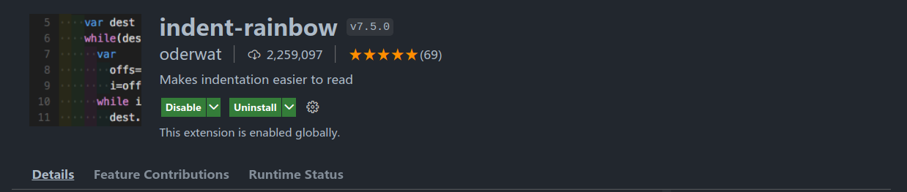
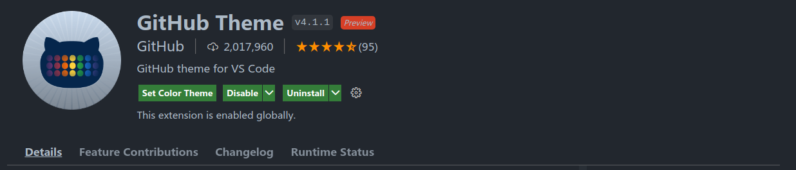
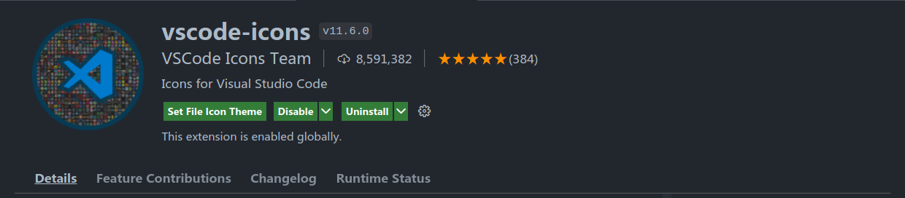

Rstudio 作为一款官方的IDE，相较于其他IDE在很多地方都有着天然的优势，但是它自身作为一款半开源的软件，相较于更加开源的软件，比如Vscode，必然会存在很多使用起来反人类的设计，并失去更多选择性。

不过对于Vscode这一类开源软件，Rstudio也具有其相对的稳定性，这一点上是开源软件所不能超越的。但奈何开源软件能github提issue啊，参与感很强😋。

正是因为这些原因，逐步让我选择抛弃Rstudio，全面改用Vscode。
用Vscode，当然是用插件啦，这里除了推荐插件以外，更多的还是分享喜悦。
<!-- more -->

不过开始之前还是需要说明，微软官网的Vscode是半开源软件，其中夹带着微软的私货，同时还会上传追踪数据，让微软白嫖测试（还有啥咱也不知道，也不敢问）。**所以推荐使用开源版本的VSCodium或者完全自己从头编译的code-oss**，我这里使用的就是VSCodium。

## 插件推荐

### R

作为宇宙万能编辑器的Vscode，能一个插件解决的事情坚决不使用两个。

[R](https://marketplace.visualstudio.com/items?itemName=Ikuyadeu.r)或者[vscode-R](https://github.com/REditorSupport/vscode-R)，是Vscode里几乎解决写R的所有需求的终极插件，包含了:

1. 代码高亮
2. 代码格式化（通过集合 languageserver 包实现）
3. 语法检查（通过集合 languageserver 包实现）
4. Rmd支持
  a. 语法检查
  b. 代码高亮
  c. 实时预览（你没看错，是是实时的）
  d. bookdown，blogdown支持
5. 代码调试（通过集合 VSCode-R-Debuger 实现）
6. 支持 radian 终端
7. 使用外部 R 主程序
8. 同 Rstudio 一致的实现
  a. 网页帮助
  b. 逐行运行
  c. Rmd 逐块运行，逐行运行以及运行先前 chunks
  d. 当前工作环境内变量查看
  e. 数据框GUI查看器（通过安装 Excel Viewer 打开）
  f. GUI包管理
  g. 绘制图片查看
9. Rstudio 插件支持
10. 远程协作开发（相当于免费版的 Rsutdio Server）

### indent-rainbow

写代码，行缩进怎么能看不清楚。[indent-rainbow](https://marketplace.visualstudio.com/items?itemName=oderwat.indent-rainbow)

### Bracket Pair Colorizer 2

写代码，括号匹配怎么能糊里糊涂。[Bracket Pair Colorizer 2](https://marketplace.visualstudio.com/items?itemName=CoenraadS.bracket-pair-colorizer-2)

**注意：**这个插件一定得注意，使用版本2，1已经弃用了但是插件库里貌似还存在。

### Git Graph

一款git辅助工具

### GitHub Theme

写代码，编辑器不好看怎么能行。[GitHub Theme](https://marketplace.visualstudio.com/items?itemName=GitHub.github-vscode-theme)

### vscode-icons

写代码，文件图标怎么能没有区分度。[vscode-icons](https://marketplace.visualstudio.com/items?itemName=vscode-icons-team.vscode-icons)

